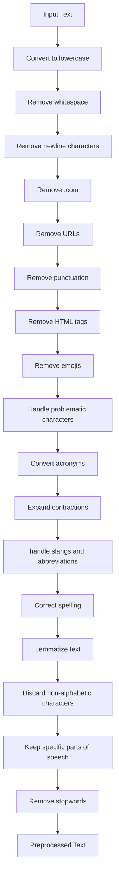

# Intensity Analysis: Emotion Classification

---


This project focuses on predicting emotions from text data using a range of machine learning and deep learning models. It encompasses preprocessing steps, multiple vectorization techniques, and integrates a Streamlit web application for interactive prediction capabilities.

---

## Table of Contents

- [Project Overview](#project-overview)
- [Dataset](##dataset)
- [Data Preprocessing](#data-preprocessing)
- [Models Used](#models-used)
- [Project Structure](#project-structure)
- [Installation](#installation)
- [Usage](#usage)
- [Streamlit App](#streamlit-app)
- [Conclusion](#conclusion)

---

## Project Overview

The primary objective of our project is to utilize a range of models and vectorization techniques to accurately predict emotions such as happiness, anger, and sadness from textual data, aiming to identify the most effective approach.

---

## Dataset

The dataset utilized in this project comprises WhatsApp chat data from Indian users. This dataset presents unique challenges due to the frequent use of native languages in the English script, along with slang and colloquial expressions. For instance, the word "khatarnaak" (खतरनाक), meaning "dangerous" in Hindi, is often employed to denote something intense or impressive positively. This linguistic blend poses difficulties for models in accurately interpreting and predicting emotions.

Nevertheless, the top-performing model, employing a Linear SVM with Word2Vec, achieved a validation accuracy of 73%.

---

## Data Preprocessing

The text preprocessing pipeline includes the following steps:

1. Convert to lowercase
2. Remove whitespace
3. Remove newline characters
4. Remove ".com" substrings
5. Remove URLs
6. Remove punctuation
7. Remove HTML tags
8. Remove emojis
9. Handle problematic characters within words( ’, iâm, 🙠and so on)
10. Convert acronyms
11. Expand contractions
12. handle slangs and  abbreviations
13. Correct spelling
14. Lemmatize text
15. Discard non-alphabetic characters
16. Keep specific parts of speech
17. Remove stopwords

---

### Text-Preprocessing Pipeline Flowchart



---

## Models Used

10 models were Tested for each vectorization method,
Best performed:

1. TF-IDF Vectorizer with XGBoost
2. Bag of Words (BoW) Vectorizer with XGBoost
3. Word2Vec with Linear SVM
4. GloVe with Bidirectional LSTM

---

## Project Structure

```
├── assets/
|   ├── comment.png
|   ├── App.png
|   ├── Emotion.png
├── Datasets/
|   ├── angriness.csv
|   ├── happiness.csv
|   ├── sadness.csv
├── Deploy/
│   ├── best_xgb_model.pkl
│   ├── bow_vectorizer.pkl
│   ├── requirement.txt
│   ├── model.keras
│   ├── streamlit.py
│   ├── text_normalization.py
│   ├── test-normalized.csv
├── .gitignore
├── project report.pdf
├── .gitignore
├── project report.pdf
├── README.md
├──glove-global-vectors-for-word-representation.zip
├──Intensity--Analysis.ipynb
├──Kaggle.json

```

---

## Installation

1. Clone the repository:

```ruby
git clone https://github.com/Eunnylans/Intensity--Analysis.git
```

2. Install the dependencies:

```ruby
pip install -r streamlit app/requirement.txt
```

3. Download necessary NLTK data:

```ruby
import nltk
nltk.download('punkt')
nltk.download('averaged_perceptron_tagger')
nltk.download('stopwords')
```

4. Download Spacy model:

```ruby
python -m spacy download en_core_web_sm
```

---

## Usage

Run the Streamlit app:

```
streamlit run streamlit.py
```

Enter text into the input box and click "Predict" to see the emotion prediction.

---

## Streamlit App

The Streamlit app allows users to input text and get an emotion prediction. It uses the pre-trained models and vectorizers to preprocess the text and make predictions.

---

## Conclusion

This project demonstrates the use of various text preprocessing techniques and machine learning models to predict emotions from text. Despite the challenges posed by the unique linguistic characteristics of the dataset, we achieved a validation accuracy of 73% with our best model. The Streamlit app provides an interactive way to test the models and see their predictions in real-time.

---

# Intensity--Analysis
